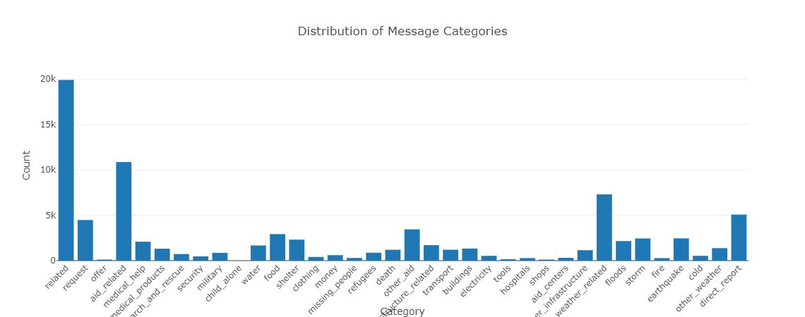

# Disaster Response Pipeline Project

This project is part of the Udacity Data Science Nanodegree. The goal is
to build a machine learning pipeline to categorize real messages that
were sent during disaster events. The web app allows emergency workers
to input a new message and get classification results in several
categories, enabling them to understand the type of help required.

## Table of Contents

-   [Installation](#installation)

-   [Project Motivation](#project-motivation)

-   [File Descriptions](#file-descriptions)

-   [How to Run](#how-to-run)

-   [Modelling Process](#modelling-process)

-   [Visualizations](#visualizations)

-   [Advising Organizations](#advising-organizations)

-   [Dataset Imbalance](#dataset-imbalance)

-   [Acknowledgements](#acknowledgements)

## Installation

To run this project, you\'ll need to clone the repository and install
the necessary dependencies.

1.  Clone the repository:

git clone
<https://github.com/ntsikim/Udacity-Project2.git>

2.  Install the necessary dependencies:

pip install -r requirements.txt

## Project Motivation

The aim of this project is to aid disaster response agencies by
categorizing incoming messages into different categories, such as
requests for aid, medical help, water, food, etc. This categorization
can significantly expedite the process of disaster management and
resource allocation, allowing for a more efficient and effective
response during disaster situations.

## File Descriptions

This project is organized into several directories and files, each
serving a specific purpose:

-   **app**: This directory contains the web app related files.

-   **run.py**: The Flask web application.

-   **templates/**: HTML templates for the web app.

-   **data**: This directory contains data files and a data processing
    script.

-   **disaster_messages.csv**: Contains messages sent during disaster
    events.

-   **disaster_categories.csv**: Contains the categories for each
    message.

-   **process_data.py**: ETL script to process data and save to SQLite
    database.

-   **models**: This directory contains the machine learning pipeline
    script and the saved model.

-   **train_classifier.py**: Script to train the machine learning model.

-   **classifier.pkl**: Saved model.

-   **README.md**: This README file.

## How to Run

Follow these steps to set up and run the project:

1.  Run the ETL pipeline to process the data and save it to an SQLite
    database:

> python data/process_data.py data/disaster_messages.csv
> data/disaster_categories.csv data/DisasterResponse.db

2.  Run the machine learning pipeline to train the classifier and save
    the model:

python models/train_classifier.py data/DisasterResponse.db
models/classifier.pkl

3.  Run the web app:

python app/run.py

4.  Open a web browser and go to http://localhost:3000/

## Modelling Process

### Data Cleaning

The data cleaning process involves merging the messages and categories
datasets, splitting the categories into separate columns, converting
values to binary, and removing duplicates. This ensures the data is
structured and clean for further analysis and modeling.

### Tokenization

A custom tokenization function is used to process the text data. This
function normalizes, lemmatizes, and tokenizes the text, which helps in
converting the raw text into a structured format that can be used for
machine learning.

### Machine Learning Pipeline

A machine learning pipeline is built to process text data and apply a
multi-output classifier using RandomForest. GridSearchCV is used to
optimize model parameters, ensuring the best possible model performance.

## Evaluation

The model is evaluated using precision, recall, and F1-score for each
category. These metrics provide a detailed understanding of the model\'s
performance, especially in handling multi-label classification problems.

## Visualizations

The web app includes the following visualizations to provide insights
into the dataset and model performance:

1.  **Distribution of Message Genres**: Shows the distribution of messages
    across different genres (direct, social, news). 
    

2.  **Distribution of Message Categories**: Shows the distribution of
    messages across different categories.
    

3.  **Correlation Heatmap of Categories**: Displays the correlation between
    different message categories.
    

### Discussion on Correlation Heatmap

The correlation heatmap visualizes the relationships between different
message categories. Each cell in the heatmap shows the correlation
coefficient between two categories, ranging from -1 (perfect negative
correlation) to 1 (perfect positive correlation).

From the heatmap:

-   **Diagonal Dominance**: The diagonal cells have a correlation of 1 since
    a category is perfectly correlated with itself.

-   **Positive Correlations**: Some categories, such as \'aid_related\' and
    \'medical_help\', show moderate positive correlations, indicating
    that messages classified as \'aid_related\' are also likely to be
    classified as \'medical_help\'.

-   **Negative or Low Correlations**: Most off-diagonal cells show low or no
    significant correlations, meaning most categories are not strongly
    related to each other.

These insights can help in understanding how different aspects of
disaster response are interconnected and could also aid in improving
multi-label classification models by focusing on inter-category
relationships.

## Advising Organizations

Based on the categories identified by the machine learning algorithm,
here are some suggested organizations to connect with:

-   Related: General disaster relief organizations such as the Red Cross
    or FEMA.

-   Request: Local emergency services (police, fire department, medical
    services).

-   Aid Related: International NGOs like Oxfam, CARE, or local community
    aid groups.

-   Medical Help/Medical Products: Hospitals, WHO, Doctors Without
    Borders.

-   Search and Rescue: Local search and rescue teams, Coast Guard.

-   Security: Local law enforcement agencies, National Guard.

-   Water/Food/Shelter: UNHCR, local food banks, shelters, and
    humanitarian aid organizations.

-   Clothing: Local charities, Goodwill, Salvation Army.

-   Money: Financial aid organizations, crowdfunding platforms like
    GoFundMe.

-   Missing People: Missing persons organizations, law enforcement
    agencies.

-   Refugees: UNHCR, local refugee assistance programs.

-   Death: Local authorities, morgues, and related services.

-   Infrastructure Related: Local government agencies responsible for
    infrastructure repair.

-   Transport: Local transportation authorities.

-   Electricity: Local power companies and utility services.

-   Tools: Local hardware stores, volunteer groups for rebuilding
    efforts.

-   Hospitals: Nearby hospitals and clinics.

-   Shops: Local businesses and retail stores.

-   Aid Centers: Local aid distribution centers and shelters.

-   Weather Related: Meteorological services, weather forecasting
    agencies.

## Dataset Imbalance

The dataset used in this project is imbalanced, meaning some categories
have significantly more examples than others. For instance, categories
like \"water\" and \"medical products\" have relatively few examples
compared to \"related\" or \"aid related.\" This imbalance can affect
the performance of the machine learning model in the following ways:

### Impact of Imbalance

-   Bias Towards Majority Classes: The model may become biased towards
    the majority classes, leading to higher accuracy for these
    categories but poor performance on minority classes.

-   Evaluation Metrics: Metrics like accuracy can be misleading. A model
    that predicts the majority class well but fails on minority classes
    can still appear to perform well overall.

### Addressing Imbalance

To address the imbalance, the following strategies can be employed:

-   Resampling Techniques: Use oversampling for minority classes or
    undersampling for majority classes to balance the dataset.

-   Class Weights: Assign higher weights to minority classes in the loss
    function to penalize misclassifications more heavily.

-   Evaluation Metrics: Emphasize precision, recall, and F1-score over
    accuracy, especially for minority classes.

### Precision vs. Recall

Depending on the application, you might prioritize precision or recall:

-   Precision: High precision is important if false positives are
    costly. For example, misclassifying a non-urgent message as urgent
    could lead to unnecessary resource allocation.

-   Recall: High recall is crucial if missing a true positive is costly.
    For instance, failing to identify a request for medical help could
    be life-threatening.

In this project, a balance between precision and recall is sought using
the F1-score, which is the harmonic mean of precision and recall. This
approach ensures that both false positives and false negatives are
minimized to the extent possible.

## Acknowledgements

-   Udacity for providing the project and dataset.

-   Figure Eight for providing the dataset.

-   Scikit-learn for the machine learning tools.
